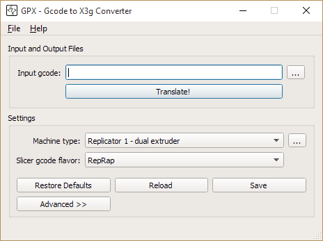

GpxUi is a graphical user interface wrapped around GPX, a command line utility.

It is Window only at the moment, but I made it with Qt with the intention of building
it for other platforms. I don't have a Mac, but I've got Linux, so if there is interest
I'll make a linux version.

GPX is a post processing utility for converting gcode output from 3D slicing
software like Cura, KISSlicer, S3DCreator and Slic3r to x3g files for standalone
3D printing on Makerbot Cupcake, ThingOMatic, and Replicator 1/2/2x printers - with
support for both stock and SailFish firmwares.

This GpxUi includes gpx.exe for use as a plugin to slicers, but also includes a
settings editor and setup program to make it easy to get GPX set up and running
with the right settings. Also includes a machine settings editor so you can mess
with arcane stuff like how many steps per mm.

## Installing and running

  1. Download and run setup.exe from the [releases](https://github.com/markwalGpxUi/releases/latest) page
  2. Choose your printer type
  3. Choose the gcode flavor of the slicer you want to use
  4. Click "Save" to save those two settings into gpx.ini
  5. Click the translate button, it'll ask for the name of the gcode file and
     the name of the output x3g file

## Notes

The setup added gpx.exe to your path, you can use this to aid in making plugins
for various slicers.  Unfortunately Slic3r needs an absolute path to its post
processing scripts so it can check to make sure it exists and is executable.
Setup also created an lnk file so that you can point Slic3r at the latest installed
version.

To add gpx as a post processor to Slic3r (makes an x3g whenever you export to gcode):

  1. Put Slic3r into expert mode via File.Preferences from the menu bar and
     restart Slic3r
  2. Choose "Print Settings" tab, "Output options" panel
  3. In "Post-processing scripts" type "c:\users\<yourusernamehere>\appdata\local\GpxUi\gpx.exe.lnk" all by itself without quotes
     or parameters and with your own user name instead of <yourusernamehere>

You can switch the settings around and gpx.exe will just use whatever you saved
last.  Settings are also saved when you use GpxUi to translate a file.

Setup added an icon to your desktop and to your start menu. If you like a clean
desktop like me, drag the desktop one to the trash, you can still run it from
start. Seems like letting you drag it to the trash was easier than bothering
you with a question in setup.

GpxUi includes an auto-updater courtesy of Squirrel for Windows. It checks for
updates when you start it. So if you leave it running or never run it, it
doesn't update.  Plus it has a limiter on it so it doesn't check every time you
boot it up, just when it has been a while. You can turn this off on the
Help.Updates... menu.

## Future features

  - As I mentioned, perhaps other platforms
  - Have setup connect gpx.exe to the right-click on gcode files menu so you
    can right-click on a gcode file and choose "Convert to x3g"
  - A warning when it notices another gpx.exe earlier on the path
  - Have an option to send a copy of the x3g to a flashair card
  - Have setup or a configuration dialog automatically add plugins to various
    slicers
  - Drag and drop?

## Dependencies

- [QT 5.4](https://www.qt.io/developers)
- [Squirrel.Windows](https://github.com/Squirrel/Squirrel.Windows) (only need
  this if you are going to build setup)

## Build instructions

1. Clone the repository
2. Get the submodules `git submodule update --init`
3. Install QT and make sure it and the mingw32 it includes is on your path, I
   run gnu make under bash so I may have introduced a build-time dependency on
   bash
4. `make`

For Windows setup.exe: `make squirrel.windows`
